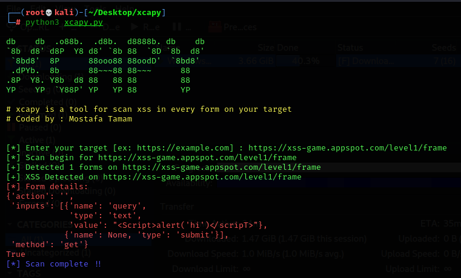

[](https://root-x.dev/)

## What is Xcapy?

 > This a simple tool XSS Detection Suite for CTFs games

## install & run
```
$ git clone "https://github.com/BlackWolfed/xcapy.git"
```
```
$ cd /xcapy
```
```
$ python3 xcapy.py
```



### Connect with me:

[][website]
[][twitter]
[][linkedin]

[website]: https://root-x.dev
[twitter]: https://twitter.com/BlackWo50331384
[linkedin]: https://www.linkedin.com/in/mostafa-bn-tamam-96308216a/
